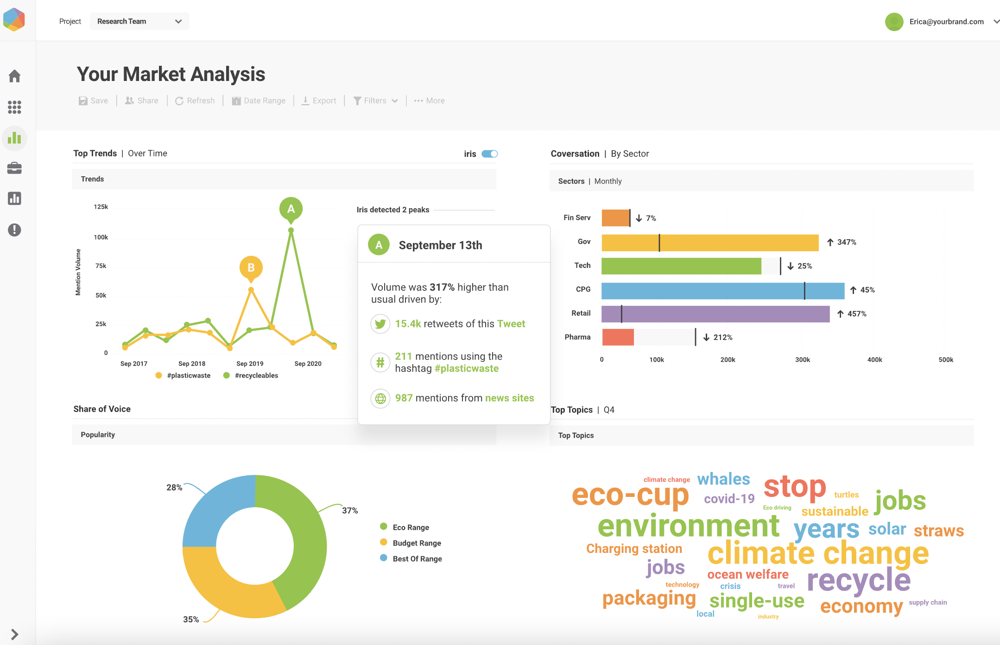
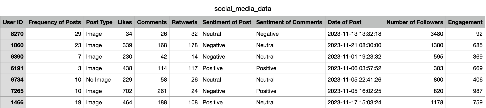
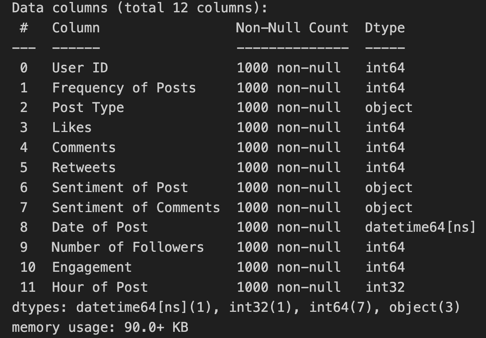
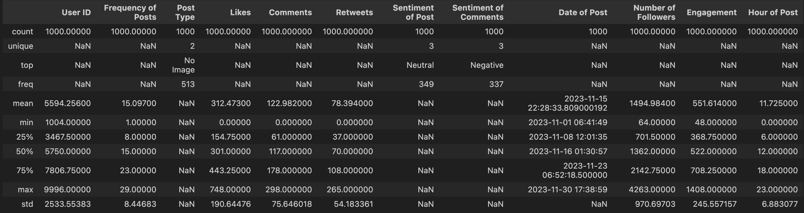
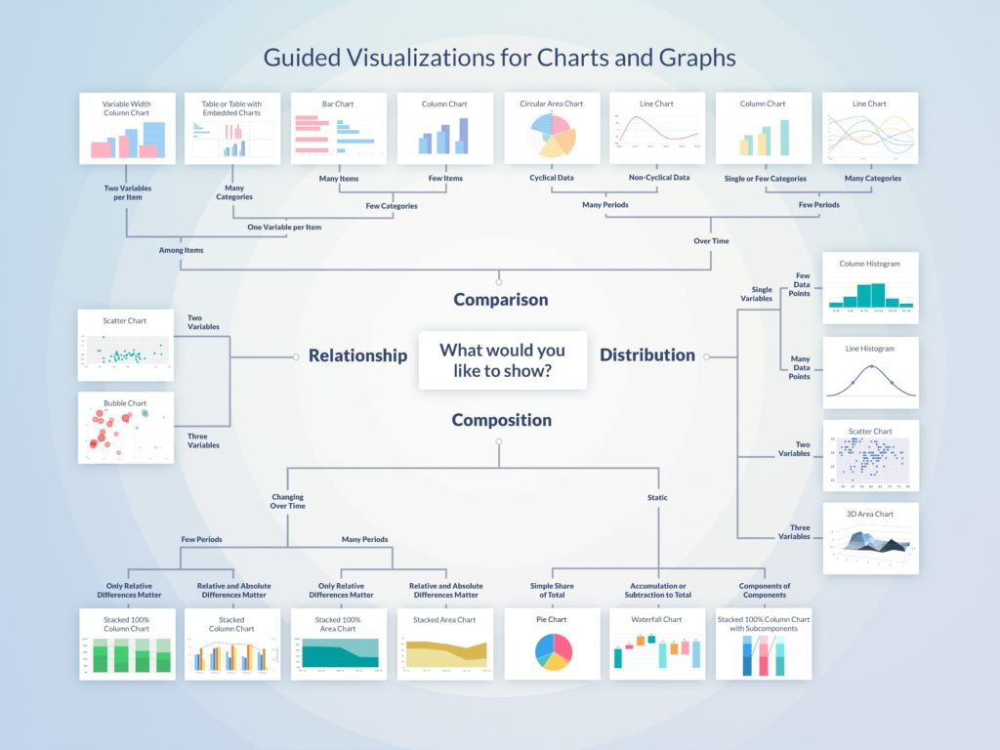
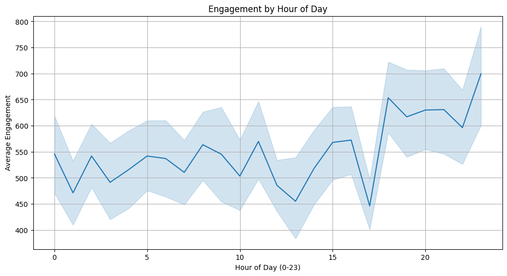
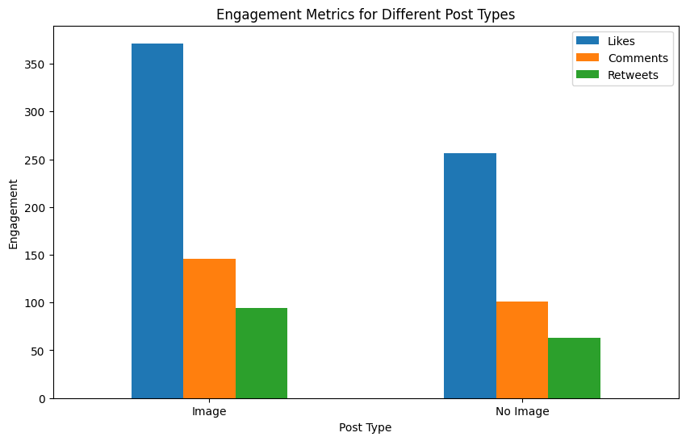
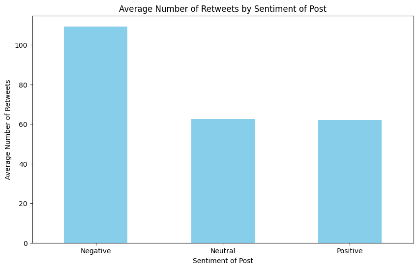
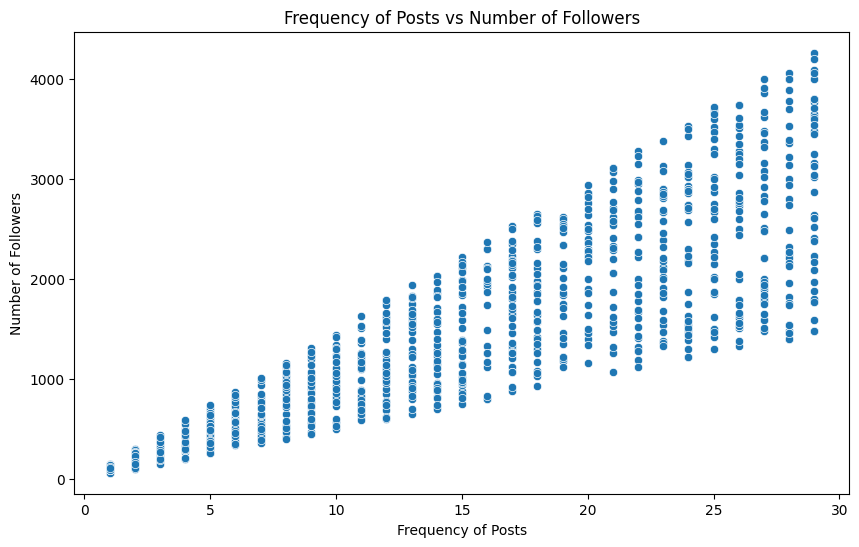
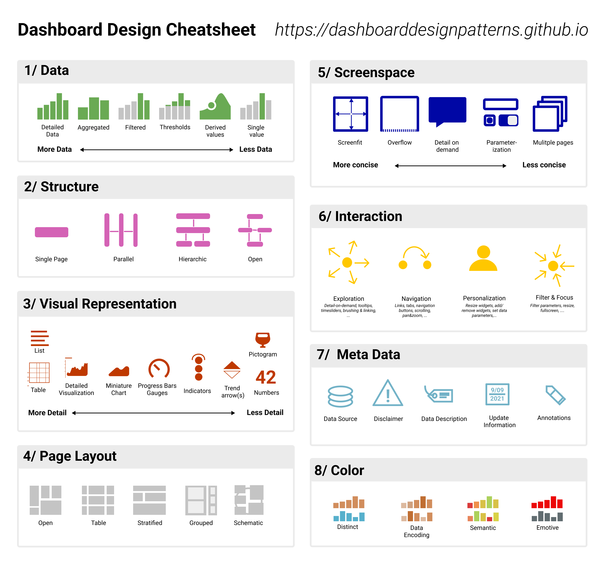

<!-- _class: lead -->

## Data Alchemy 
### From Listening to Informed Decision Making

Guest Lecture | Universiti Sains Malaysia

---
<!-- paginate: true -->
<!-- footer: Guest Lecture - Lalitha Shamugam  -->

# Presenter

**Lalitha Shamugam**  

- [Google Scholar](https://scholar.google.com/citations?user=F-YH72IAAAAJ&hl=en) 

- [LinkedIn](https://www.linkedin.com/in/lalithashamugam/)

**Materials**
- Jupyter Notebook, Dataset, Slides --> [GitHub](https://github.com/lalitha1910) 

- Visualisation, Dashboard, Story --> [Tableau Dashboard](https://public.tableau.com/app/profile/lalitha.shamugam/vizzes)

---
# Overview

1. Social Listening 
2. Hypothesis Development
3. Data Collection & Pre-processing
4. Case Study
5. Dashboard


---
<!-- _class: lead -->

# 1. Social Listening
---
# Introduction

- **Social listening** - process of identifying and assessing what is being said about a company, individual, product, or brand on various social media platforms.

- Importance of social listening includes:

    1. Identifies brand mentions and customer feedback

    2. Tracks market trends and consumer sentiments

---
# Tools


---
# Social Listening Dashboard



---

# Key Aspect and Technique

**1. Monitoring mention**
- Track real-time mentions of your brand across platforms
- Use sentiment analysis to gauge customer feelings

**2. Tracking Hashtags and Keywords**
- Identify trending topics related to your brand or industry
- Monitor specific campaigns or events through targeted hashtags

---
 # Key Aspect and Technique

 **3. Audience Insights** 
 - Understand demographics, behaviors, and preferences of your audience
- Adapt marketing strategies based on audience engagement patterns

---

<!-- _class: lead -->

# 2. Hypothesis Development

---
# Definition

A hypothesis is a tentative explanation that accounts for a set of facts and can be tested by further investigation.

**Characteristics**

Well-formed business hypotheses have three key characteristics:
1. Testable
2. Precise 
3. Discrete

---
# Example

*"Engaging daily on Twitter for one month will increase our brand's follower count by 10%"*

- **Testable**: This hypothesis can be easily tested by tracking the number of followers on Twitter over a month
- **Precise**: It specifies the platform (Twitter), the frequency of engagement (daily), and the duration (one month)
- **Discrete**: Focuses on a single, clear outcome – increasing the follower count by 10%

---
<!-- _class: lead -->

# 3. Data Collection &
# Pre-processing

---
# First Step...

**Data Collection:**
Employ Boolean search techniques to target specific brand-related content and use Isentia tools for data crawling

**Data Cleaning:**
Researchers clean the data to ensure accuracy and relevance

**Categorization:**
Classify data based on sentiments and topics

---

<!-- _class: lead -->

# 4. Case Study 

---
# Topic

*Malaysian Twitter User Engagement for Lalitha Sdn Bhd*

**Description:**

This project entails a data analysis of Twitter engagement for Lalitha Sdn. Bhd., utilizing a synthetic dataset generated via Python. The objective is to formulate and test four hypotheses through detailed data visualizations, aiming to uncover insights and patterns that drive engagement on the platform.

---
# Objective

1. To determine if social media posts made during evening hours receive higher engagement than posts made at other times.
2. To assess whether including images in social media posts increases engagement metrics such as likes, comments, and retweets.
3. To explore the relationship between the sentiment of social media posts (negative, positive, neutral) and the number of retweets they receive.
4. To investigate the correlation between the number of followers a user has and the frequency of their social media posts.

---

## Dataset Info

- This is a synthetic dataset created for today's class
- It is available in the following [link](https://www.kaggle.com/datasets/carrie1/ecommerce-data/data).



---
## Dataset Description

1. This synthetic dataset captures a month's worth of Twitter interactions among followers of Lalitha Sdn Bhd.
2. It consists of **1,000** entries, each representing a distinct tweet from users who follow the company.
3. Ideal for social media analytics, this dataset can help the company in strategizing its Twitter presence. 
4. It offers insights for enhancing user engagement, determining effective content strategies, and identifying optimal posting times.

---
## Dataset Attributes

- **User ID** 
- **Frequency of Tweets** 
- **Tweet Type** 
- **Likes, Comments, Retweets** 
- **Sentiment of Tweet and Comments** 
- **Date and Time of Tweet** 
- **Number of Followers (of Users)** 
- **Engagement Score** 
 

---
## Read File 
- Import the CSV file as a DataFrame using the pandas library.

```py
# import libraries
import pandas as pd
import matplotlib.pyplot as plt
import seaborn as sns

# read csv file
df = pd.read_csv('social_media_data.csv')

# view file
df.head()
```

---
## Basic Info

- The info() method in pandas was used to inspect the details.

```py
# find data info
df.info()
```



---
## Statistical Description

- The describe() method was used to obtain a statistical summary.

```py
# statistical description
df.describe(include='all')
```



---
## Hypothesis 1

*Date of Post* and *Engagement* Relationship:

- **Hypothesis**: *Posts made during evening hours receive higher engagement compared to posts made at other times of the day*

**Choice of Visualisation**
A line chart is ideal for this hypothesis because it will clearly illustrates trends and comparisons over time, effectively showing how engagement varies across different times of the day.

---
## Data Visualisation Guide



---
## Visualisation 1



---
## Hypothesis 2

*Social Media Post* and *Engagement* Relationship:

- **Hypothesis**: *Social media posts that include images will receive higher engagement metrics (likes, comments, and retweets) compared to posts without images*

**Choice of Visualisation**
A bar chart is suitable for this hypothesis as it clearly compares discrete categories—posts with and without images—showing the difference in engagement metrics  in a visually distinct  manner.

---
## Visualisation 2



---
## Hypothesis 3

*Post with Negative Sentiment* and *Retweets* Relationship:

- **Hypothesis**: *Posts with negative sentiment are associated with a higher number of retweets than posts with positive or neutral sentiments*

**Choice of Visualisation**
A bar chart is ideal for this hypothesis because it effectively compares engagement across distinct categories—negative, positive, and neutral sentiments—allowing for a clear visual representation of differences in user interaction based on the sentiment of the posts.

---
## Visualisation 3



---
## Hypothesis 4

*Frequency of posts* and *Number of Followers* Relationship:

- **Hypothesis**: *There is a positive correlation between the frequency of posts by social media users and their number of followers*

**Choice of Visualisation**
A scatter plot is suitable for this hypothesis as it visually represents the correlation between two continuous variables—frequency of posts and number of followers—allowing for the observation of patterns or trends in the data.

---
## Visualisation 4



---
<!-- _class: lead -->

# 5. Dashboard

---
### Dashboard Design [[Website](https://dashboarddesignpatterns.github.io/)][[Journal article](https://arxiv.org/abs/2205.00757)]




---
<!-- _class: lead -->

# [Tableau Dashboard](https://public.tableau.com/views/MalaysianTwitterUserEngagementforLalithaSdnBhd/Dashboard1?:language=en-GB&:display_count=n&:origin=viz_share_link)

---
## Reference

- [The Data Visualisation Catalogue](https://datavizcatalogue.com/)

- Dashboard Design Pattern [[Website](https://dashboarddesignpatterns.github.io/)][[Journal article](https://arxiv.org/abs/2205.00757)]

---
# Activity

- Go to [GitHub]() to download the dataset

- Go to [Tableau Public](https://public.tableau.com/app/discover) and sign up an account


